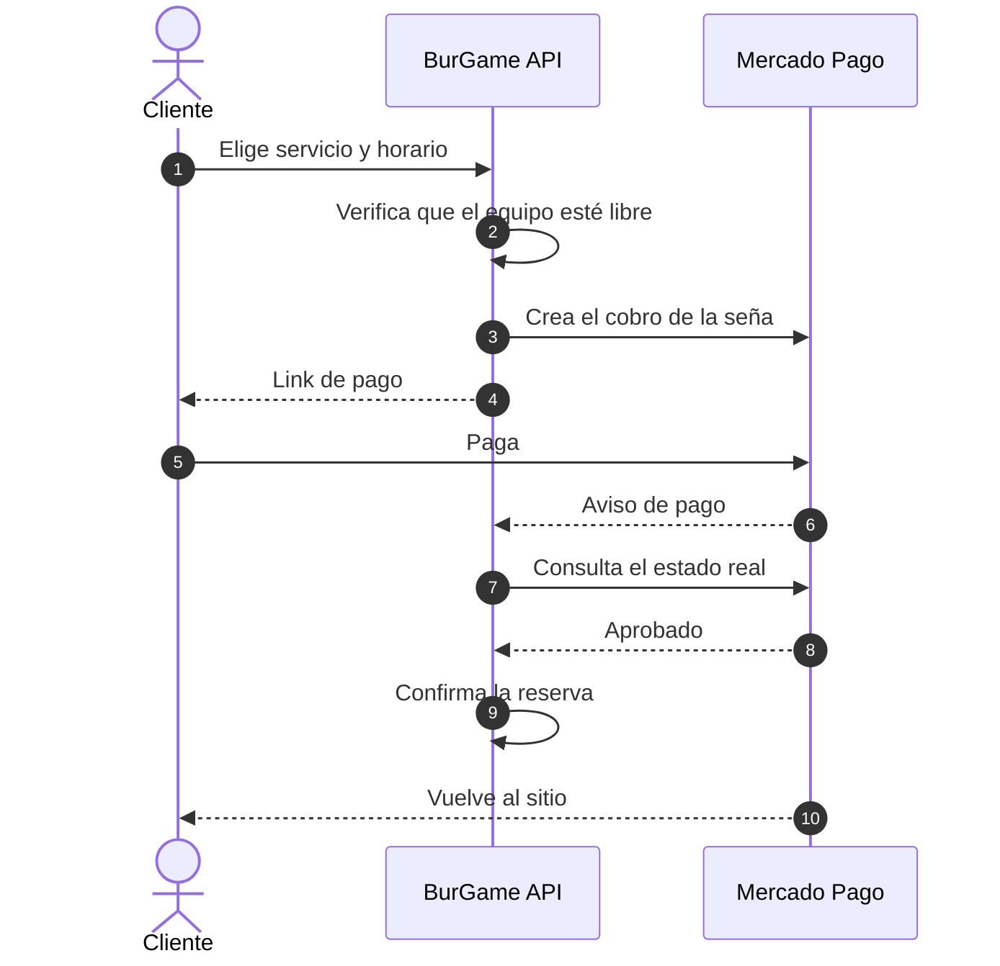
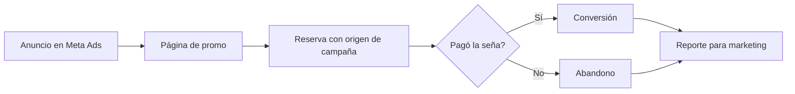

### Cómo se reserva y se paga

La reserva queda en espera hasta que Mercado Pago confirma el cobro. El backend no confía en el aviso: vuelve a preguntar el estado antes de confirmar.

### Del anuncio a la reserva paga

Cada reserva guarda de qué campaña vino, así el negocio mide qué anuncios terminan en un pago.

