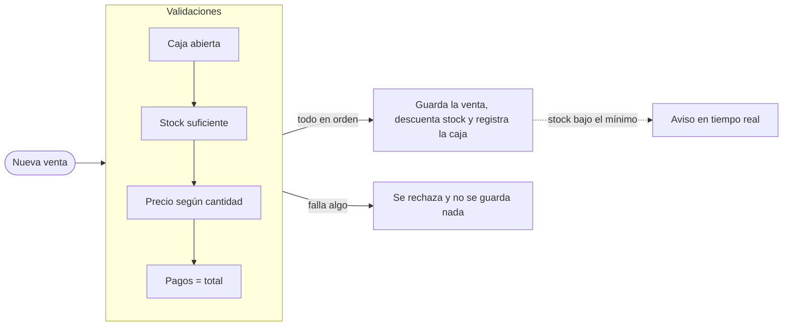

### Qué pasa en cada venta

Toda la venta es una sola operación. Si falla cualquier paso, se deshace todo y no queda stock ni caja a medio registrar.

```mermaid
flowchart LR
  V([Nueva venta]) --> VAL
  subgraph VAL [Validaciones]
    direction TB
    A[Caja abierta] --> B[Stock suficiente] --> C[Precio según cantidad] --> D[Pagos = total]
  end
  VAL -- todo en orden --> OK[Guarda la venta, descuenta stock y registra la caja]
  VAL -- falla algo --> X[Se rechaza y no se guarda nada]
  OK -. stock bajo el mínimo .-> N[Aviso en tiempo real]
```
