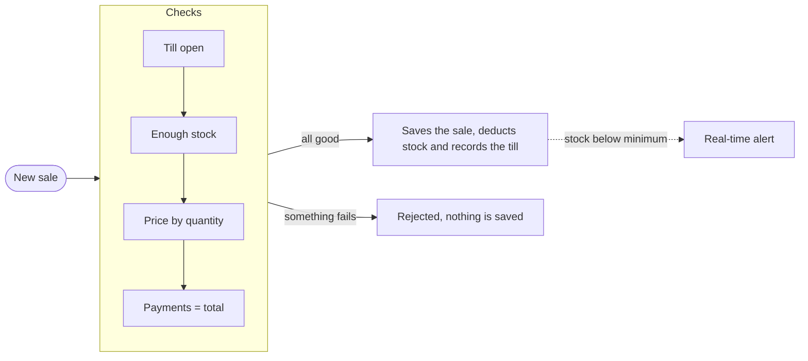

### What happens in every sale

The whole sale is a single operation. If any step fails, everything is rolled back and no stock or till entry is left half-recorded.

```mermaid
flowchart LR
  V([New sale]) --> VAL
  subgraph VAL [Checks]
    direction TB
    A[Till open] --> B[Enough stock] --> C[Price by quantity] --> D[Payments = total]
  end
  VAL -- all good --> OK[Saves the sale, deducts stock and records the till]
  VAL -- something fails --> X[Rejected, nothing is saved]
  OK -. stock below minimum .-> N[Real-time alert]
```
