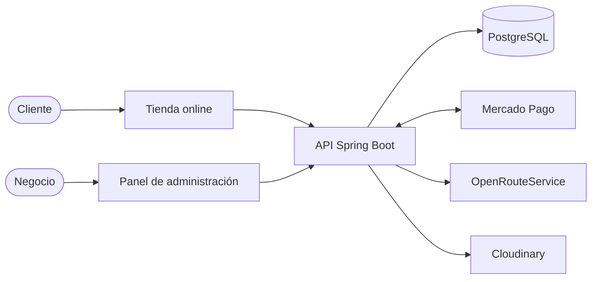
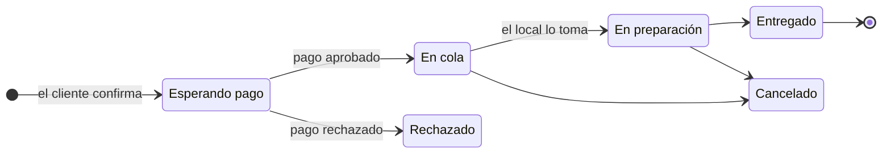

### Cómo se conectan las piezas

La tienda y el panel hablan con la misma API. La API es la única que conoce los precios, habla con Mercado Pago y calcula el envío.

### La vida de un pedido

Un pedido nace esperando el pago, y solo pasa a la cocina cuando Mercado Pago confirma que se cobró.

